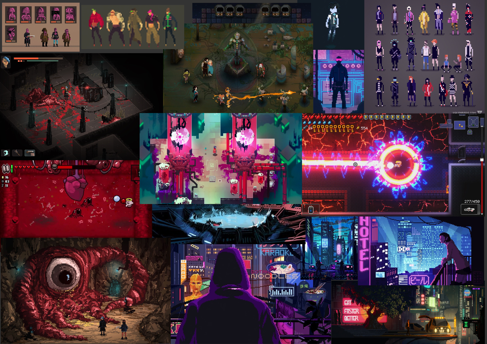

# Game Master

### Table of Contents

* [Description](#description)
* [Installation/ Startup](#installation)
* [Roadmap](#roadmap)
* [Contributing](#contributing)
* [Acknowledgements](#acknowledgements)
* [License](#license)
* [Project-Status](#project-status)

<!-- DESCRIPTION -->
### Description
GameMaster is a Bullet-hell arena multiplayer pixel-art game with a special twist.

There are 3 Players and a Game Master in an arena-like setting. The Players have to survive the enemies the Game Master puts on them until time runs out. The Game Master's goal is to eliminate all players through spawning enemies. The Players have won when the time has expired and still one player is alive.

At the beginning the players have to choose between different prebuilt characters with specific attributes like there is a tank with low damage but great health or a melee damage dealer with high mobility and damage but low health.

Game start: One random player is chosen to take the role of the Game Master which takes control of the arena and can spawn enemies, the spawn-rate is limited by the heat-level which increases when the Game Master spawns enemys rapidly.

The game network system is a client-server model with one player hosting the server and the others joining in.

 

    
  

        Initial moodboard of the game
  

<!-- INSTALLATION -->
### Installation

#### Controls
- `LMB` Shoot/ check menu buttons
- `ESC` Open in-Game-Menu
- `W/A/S/D` Move character

#### Start multiplayer round
- All players must be connected to the same network
- Open project in IntelliJ IDEA
- Run `DesktopGameDriver.main()`
- Click through menu until you are prompted to choose "Host-Button" or "Join-Button"
- Choose "Host" if you want to host the server or "Join" if one of the other players has already started the server
- *Host:* your IP address is displayed > send it to your friends to join > press start to create server and join
- - InGame: press `ESC` to open in-Game-Options > press "Start-Button" to trigger random Game-Master choice and start timer
- - "Start-Button" is only available for the Host of the game
- *Join*: enter the IP address of the Host > press start to join > if nothing is entered you create your own game without network features
> Make sure to use the correct IP address to connect, maybe double check with `ipconfig`

#### Simulate a multiplayer round on a single machine
- Open project in IntelliJ IDEA
- You need to run two game intances of `DesktopGameDriver.java` 
- - *First game instance*: right click on `DesktopGameDriver.java` > More Run/Debug > Run with Coverage
- - *Second game instance*: Run `DesktopGaDriver.main()` like normal
- Two instances of the game should appear
- Click through menu till you are prompted to choose "Host" or "Join" 
- Choose "Host" on one of the instances and "Join" on the other instance

#### Build and test
- Run tests: `./gradlew clean test`
- Build project: `./gradlew clean build`

<!-- ROADMAP -->
### Roadmap
- Expected release of first playable alpha [1.0.0] - 2023-02-17

<!-- CONTRIBUTING -->
### Contributing
The project was created with Java version 18.0.1.1 in IntelliJ IDEA. 
LibGdx and Box2D were used as the game development framework. 
The assets where created with Adobe Photoshop, Adobe Animate, Aseprite and Tiled.
Javadoc was used for code documentation.

<!-- ACKNOWLEDGEMENTS -->
### Authors and Acknowledgements
- created by Furkan, Despoina, Bianca, Georg, Tim, Manuel 

<!-- LICENSE -->
### License
- open source

<!-- PROJECT-STATUS -->
### Project status
- done

***
